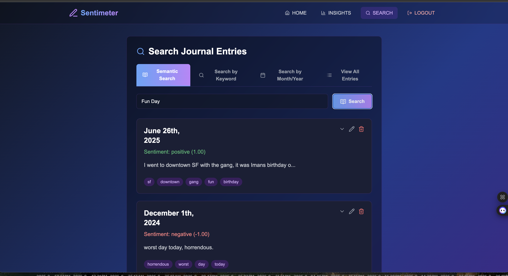
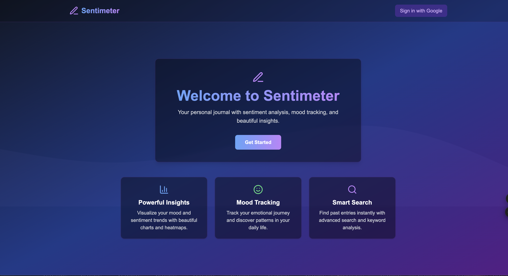

# Sentimeter


## Overview

**Sentimeter** is a journaling app designed to capture thoughts, track moods, and provide insights into users' emotional journeys in a secure and visually appealing environment.

---

## Project Structure

### Frontend
Located in the `SentimeterFrontend` REPO at https://github.com/ahatanar/SentimeterFrontend, this component includes:
- **React-based UI**
- Source files for user interaction
- Styling for a user-friendly experience

### Backend
Located in this `Sentimeter` Repo, this component includes:
- Flask-based backend server
- RESTful APIs for journaling, mood tracking, and weather integration
- Unit tests to ensure backend functionality
- API Integrations as well DB logic for PostgresSQL

---

## Installation and Setup

### Backend

1. Navigate to the backend directory:
   ```bash
   cd Sentimeter
2. Install the required Python dependencies:
   ```bash
   python setup.py install
   pip install -r requirements.txt
3. Start the backend server:
   ```
   python src/app.py


### 
cd Centimter

# Start the Celery worker (for async enrichment, email, survey reminders)
python3 -m celery -A src.celery_app worker --loglevel=info --pool=solo

# (Optional) Start the Celery beat scheduler (for periodic/scheduled tasks)
python3 -m celery -A src.celery_app beat --loglevel=info

We use Celery workers for async tasks such as email sending, survey reminders, and data enrichment through AI. 
- The **worker** processes background jobs (enrichment, email, etc.) so the user doesn't have to wait for slow operations.
- The **beat scheduler** (optional) schedules periodic tasks, like sending reminders or weekly surveys.

**You must have at least one worker running for async features to work.**
- If you want scheduled reminders, also run the beat scheduler.

## App Screenshots

### Homepage


### About Section


### Insights Page 1


### Insights Page 2


### Search Page


### Functional Diagram


### System Architecture


