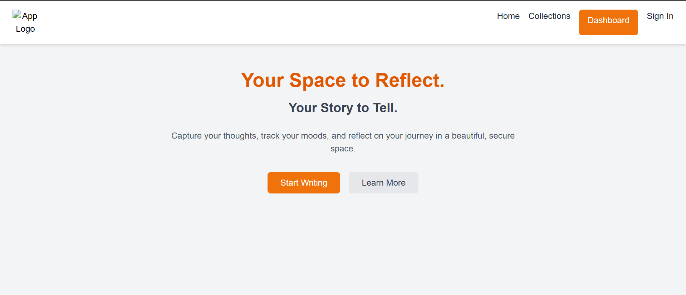

# Sentimeter


## Overview

**Sentimeter** is a journaling app designed to capture thoughts, track moods, and provide insights into users' emotional journeys in a secure and visually appealing environment.

---

## Project Structure

### Frontend
Located in the `SentimeterFrontend` folder, this component includes:
- **React-based UI**
- Source files for user interaction
- Styling for a user-friendly experience

### Backend
Located in the `Sentimeter` folder, this component includes:
- Flask-based backend server
- RESTful APIs for journaling, mood tracking, and weather integration
- Unit tests to ensure backend functionality

---

## Installation and Setup

### Backend

1. Navigate to the backend directory:
   ```bash
   cd Sentimeter
2. Install the required Python dependencies:
   ```bash
   pip install -r requirements.txt
3. Start the backend server:
   ```
   python src/app.py

### Frontend
1. Navigate to the frontend directory:
   ```
   cd SentimeterFrontend
2. Install the required npm dependencies:
   ```
   npm install
3. Run the frontend development server:
   ```
   npm run dev

## HomePage
### Home Page


### Learn More Section


### Login Page


### Dashboard


