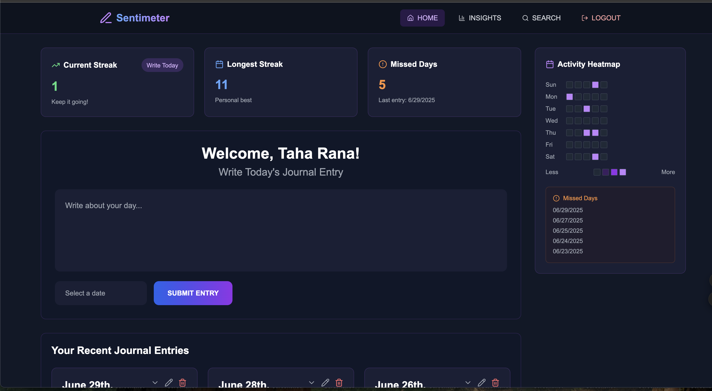

# Sentimeter


## Overview

**Sentimeter** is a journaling app designed to capture thoughts, track moods, and provide insights into users' emotional journeys in a secure and visually appealing environment.

---

## Project Structure

### Frontend
Located in the `SentimeterFrontend` REPO at https://github.com/ahatanar/SentimeterFrontend, this component includes:
- **React-based UI**
- Source files for user interaction
- Styling for a user-friendly experience

### Backend
Located in this `Sentimeter` Repo, this component includes:
- Flask-based backend server
- RESTful APIs for journaling, mood tracking, and weather integration
- Unit tests to ensure backend functionality
- API Integrations as well DB logic for PostgresSQL

---

## Installation and Setup

### Backend

1. Navigate to the backend directory:
   ```bash
   cd Sentimeter
2. Install the required Python dependencies:
   ```bash
   # For Windows users
   pip install -r requirements-windows.txt
   
   # For macOS/Linux users
   python setup.py install
   pip install -r requirements.txt
3. Start the backend server:
   ```
   python -m src.app 
   


### Celery Workers & Async Processing

We use Celery workers for async tasks such as email sending, survey reminders, and data enrichment through AI. 
- The **worker** processes background jobs (enrichment, email, etc.) so the user doesn't have to wait for slow operations.
- The **beat scheduler** (optional) schedules periodic tasks, like sending reminders or weekly surveys.

**You must have at least one worker running for async features to work.**

#### Broker Configuration
- **Production**: Uses Redis as the message broker
- **Local Development**: Automatically falls back to memory broker if Redis is not available
- **Redis Installation**: Optional for local development, but recommended for production-like testing

#### Platform-Specific Worker Commands

**Windows Development:**
```cmd
# Start Celery worker with Windows-specific configuration
set IS_CELERY_WORKER=1
set TOKENIZERS_PARALLELISM=false
python -m celery -A src.celery_app worker --loglevel=info --pool=solo --concurrency=1

# Start Celery beat scheduler (in a separate terminal)
set IS_CELERY_WORKER=1
python -m celery -A src.celery_app beat --loglevel=info
```

**macOS Development (with ML model fixes):**
```bash
# Start Celery worker with macOS-specific fixes for PyTorch/MPS issues
PYTORCH_ENABLE_MPS_FALLBACK=1 TOKENIZERS_PARALLELISM=false IS_CELERY_WORKER=1 \
celery -A src.celery_app worker --loglevel=info --pool=solo --concurrency=1

IS_CELERY_WORKER=1 celery -A src.celery_app beat --loglevel=info
```

**Linux/Production (Render, Docker, etc.):**
```bash
IS_CELERY_WORKER=1 celery -A src.celery_app worker --loglevel=info --concurrency=2

IS_CELERY_WORKER=1 celery -A src.celery_app beat --loglevel=info
```

**Quick Start Scripts:**
```bash
# Windows Development
start_windows.bat

# macOS Development
./start_local.sh

# Linux/Production (Render, Docker, etc.)
./start.sh
```

#### Why Different Commands?
- **Windows**: Requires `--pool=solo` and environment variables to avoid multiprocessing issues and PyTorch conflicts
- **macOS**: Requires `--pool=solo` and environment variables to fix PyTorch MPS conflicts in forked processes
- **Linux**: Can use standard multiprocessing pool with higher concurrency for better performance

## App Screenshots

### Homepage


### About Section


### Insights Page 1


### Insights Page 2


### Search Page


### Functional Diagram


### System Architecture


